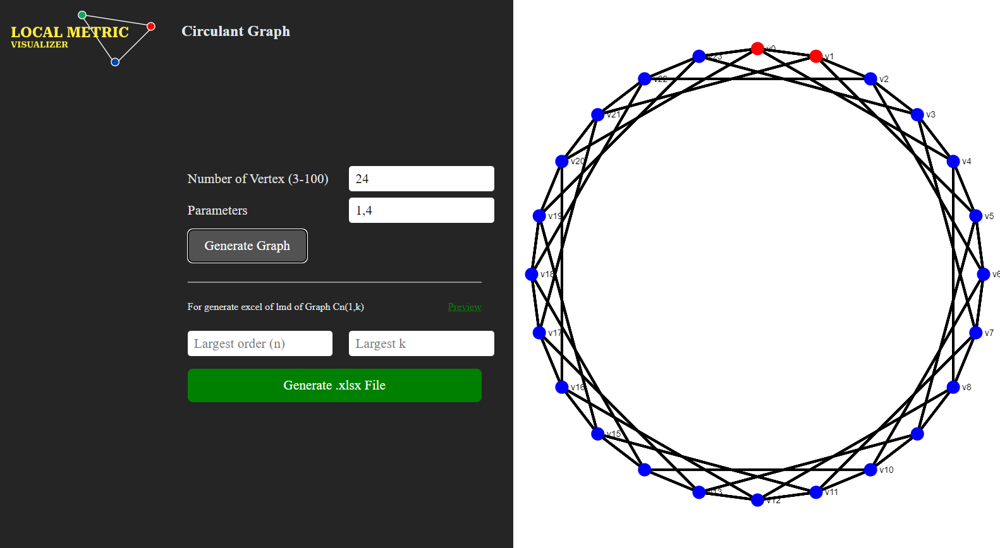
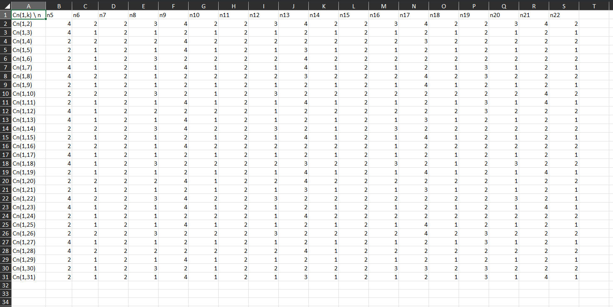
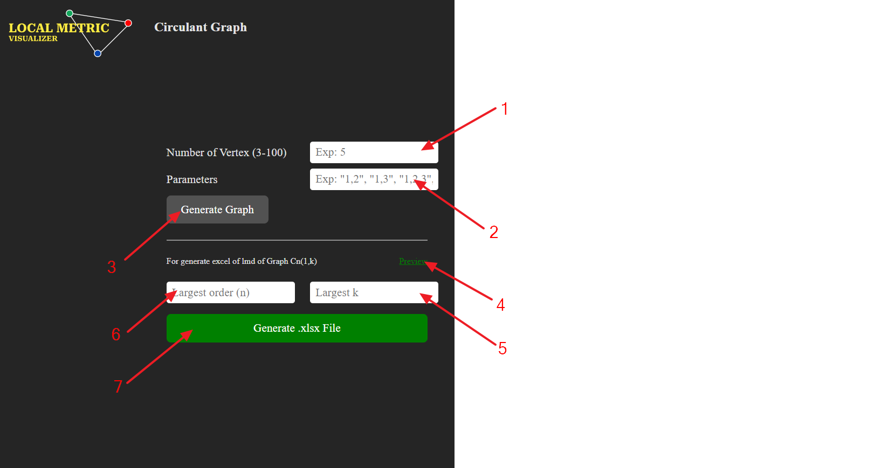

# Local Metric Set Visualizer of Circulant Graph

## Definition 

### Circulant Graph
Circulant Graph, notated by })  is n-vertex graph which every }) are adjacent with \mod&space;n}) for . Set  is _a connected set_ of the graph. (Nicoloso S., 2007)

### Local Metric Dimension
Let a subset }) for G is a simple connected graph. If &space;=&space;r(v|W)}) for every pair  adjacent, then W is local resolving set of G. For a minimum cardinality of W, is defined by Local Metric Dimension of G, notated by lmd(G) and all element of W is local metric basis of G. Every nontrivial connected graph G have local resolving set, for trivial example is V(G) (Okamoto F., 2010)

## About this app
Local Metric Visualizer are a web app, built by Muhammad Allf Darmamulia, used to visualize a circulant graph and it's local metric basis (represented by red's dots). To retrieve local metric basis, it reference to Distance Matrix of graph, which generated by an algorithm implementing queue's method. For disclaimer, there are might having multiple list of local metric basis for any circulant graph. What's appear below is one of them.

Below divider at picture above is form field that intend to generate excel file about list of local metric basis reference to a few _k_'s and _n_'s. The result example is represented by picture below

## How to use

1. Input Field for determine a number of vertex of graph
2. Parameter's input, that represents _k1_, _k2_,..., _km_
3. A button for generate a graph
4. Image link contains preview of generated excel
5. A maximum _k_ that will generate a consecutive graph Cn(1,5), Cn(1,6),..., Cn(1,k)
6. A maximum _n_ that will generate a consecutive graph C1(1,k), C2(1,k),..., Cn(1,k)
